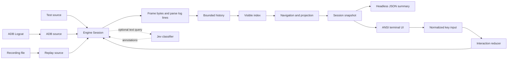

# Logview architecture

This page describes the implementation in this checkout. It is for maintainers who need to change capture, replay, filtering, semantic classification, or the terminal UI without moving state across the wrong boundary.

The product is a keyboard-driven Android log viewer. `live` captures one ADB Logcat stream. `record` stores raw source packets in a versioned JSON Lines recording. `replay` feeds those packets through the same session pipeline. The CLI can emit a final JSON summary for headless use or attach an ANSI terminal UI when stdout is a TTY.

The implementation has four packages:

| Package | Owns | Must not own |
| --- | --- | --- |
| `@logview/core` | Pure framing, parsing, filters, navigation, interaction reduction, display-safe projection | Bun APIs, files, processes, clocks, terminal codes, or the TypeSafe SDK |
| `@logview/engine` | `Session`, bounded storage, source consumption, recording, scheduling, adapter implementations, and semantic coordination | TUI imports or terminal state |
| `@logview/cli` | Argument parsing, config loading, source and session composition, command exit handling | Session policy or terminal rendering |
| `@logview/tui` | ANSI frames, raw terminal input, presentation state, and terminal cleanup | History, source lifecycle, or filter membership |

`tests/architecture/import-boundaries.test.ts` enforces the important import rules. The public package entry points are `packages/*/src/index.ts`.

## Runtime flow

`Session` is the application boundary. The terminal UI and headless tests use the same public methods:

- `start()` begins source consumption.
- `dispatch(command)` applies navigation, filter, resize, and line-display commands.
- `snapshot()` returns a consistent immutable view model.
- `subscribe(listener)` receives coalesced data updates and immediate command updates.
- `sourceDone` resolves after the source, queued bytes, pending local filter, and active semantic work finish.
- `stop()` cancels source and scheduled work, then releases owned resources.

The API and snapshot shapes live in `packages/engine/src/contracts.ts`. Keep application behavior behind this API. In particular, tests must not mutate `HistoryStore` or `VisibleIndexStore` to manufacture session state.

## Ingest, history, and projection

A `LogSource` emits lifecycle events, ordered byte packets, notices, and one terminal result. The live ADB adapter and replay adapter implement this port in `packages/engine/src/adapters/`. The session accepts only stdout packets for parsing. It still counts stderr bytes and recording preserves both streams.

For each stdout packet, the session:

1. Adds the packet to a bounded `IngestQueue`.
2. Frames complete lines before decoding them.
3. Parses the Logcat profile or attaches an unmatched line to the preceding event as a continuation.
4. Assigns a monotonically increasing session-local event ID.
5. Appends the event to bounded history and removes evicted IDs from visible and semantic state.
6. Adds matching IDs to the active index and reconciles navigation by event ID.
7. Projects only the visible event window into `ViewRow` values when a snapshot is built.

`HistoryStore` owns retained `LogEvent` values. `VisibleIndexStore` owns matching event IDs, not event copies. Navigation stores `topId` and `selectedId` rather than array positions. That is why browsing can remain stable when later events arrive or retention removes old events.

The session does its commits synchronously. It yields only between bounded work slices. Do not introduce an `await` between history, index, and navigation updates.

### Limits that shape the design

The defaults in `packages/core/src/types.ts` are part of the implementation contract:

| Limit | Default | Why it exists |
| --- | ---: | --- |
| Retained events | 100,000 | Caps history by count. |
| Charged history | 64 MiB | Caps retained text and event overhead. |
| Queued source bytes | 4 MiB | Applies backpressure before userland packet queues grow without bound. |
| Packet and retained line | 64 KiB | Bounds individual source and viewer records. |
| Work slice | 4 ms or 256 lines | Returns control to the event loop during heavy input. |
| Terminal minimum | 40 columns by 8 rows | Below this size, the session keeps ingesting and the UI shows a resize message. |

The history charge is accounting, not measured process memory. The performance tests distinguish structural bounds from advisory benchmark timings.

## Commands, configuration, and sources

`packages/cli/src/main.ts` parses three commands:

| Command | Source and result |
| --- | --- |
| `live` | Builds an ADB source. It needs one usable device unless `--serial` selects one. |
| `record` | Streams raw source packets to a new recording and finalizes a footer. It does not create a viewer session or load the TUI. |
| `replay` | Reads a recording through the replay source. Timed and instant replay use the normal session ingestion path. |

For `live` and `replay`, the CLI loads `logview.json` from the working directory unless `--config PATH` is supplied. `packages/cli/src/config.ts` validates the file with Effect Schema. Command-line flags override config values. `TYPESAFE_DEFAULT_MODEL` overrides the semantic model, and `TYPESAFE_API_KEY` stays in the environment.

The ADB adapter builds an argument vector. It does not interpolate a shell command. Its fixed capture profile is documented in the README and exported as `LOGCAT_ARGS` from `packages/engine/src/adapters/adb.ts`.

### Recording format

A recording is UTF-8 JSON Lines:

1. One `header` record identifies `logview-recording` version 1 and its provenance.
2. Zero or more base64 `chunk` records preserve packet sequence, stream, bytes, and source offset.
3. One `end` record gives the final outcome and chunk count.

`packages/engine/src/recording-schema.ts` encodes, decodes, and validates these records. `packages/engine/src/adapters/recording-files.ts` owns atomic file publication and no-clobber behavior. By default, replay rejects an unfinished recording. `--allow-partial` permits only an incomplete final JSON line and reports a persistent notice.

## Filters and navigation

`parseQuery` in `packages/core/src/query.ts` turns the one-line query into a `FilterSpec` and a `SearchMode`. A `~` before the text selects Jev; the TUI and `logview query` share this parser. `completeQuery` in `packages/core/src/completion.ts` returns a ghost suffix and alternatives from `Session.queryCandidates()`, which `packages/engine/src/vocabulary.ts` counts as events arrive.

`@logview/core` prepares a filter from minimum level, exact tag, PID, and text. Local filtering combines populated fields with AND. The text match is a case-insensitive literal match over retained source text. `reduceInteraction` turns normalized keys into session commands or local focus changes. It keeps editor drafts in the TUI layer until Enter commits a filter command.

When a filter changes, `Session` starts a revisioned `FilterJob` in `packages/engine/src/reindex.ts`. The old visible index remains active while the new candidate index scans retained events in slices. New arrivals are tested against both filters. Only the newest completed revision can replace the active index. This prevents an old scan from publishing after a later query.

The terminal interface has separate presentation focus for the list, filter editor, inspector, and help. It does not own a second selection or scrolling model. `packages/core/src/interaction.ts` maps keys, then `Session.dispatch` applies the resulting command.

`packages/core/src/projection.ts` converts the visible event window into fixed-width `ViewRow` values. It escapes control bytes, clips or wraps messages, limits the inline continuation preview, and shares column geometry with the UI headings. `CHROME_ROWS` defines the reserved control rows for both projection and terminal layout.

## Optional semantic text queries

Semantic filtering is active only when the CLI has created a Jev classifier and the active text query is nonempty. It changes the meaning of the text field from a literal filter to a natural-language query. The non-text local fields still apply first.

`SemanticCoordinator` in `packages/engine/src/semantic/coordinator.ts` owns this work:

- It version-controls queries and aborts pending work when the query changes.
- It prioritizes new matching events over history backfill.
- It caps queued IDs, in-flight requests, batch size, and encoded request size.
- It validates response session ID, request ID, query revision, and every returned event ID before applying annotations.
- It retries one transient batch failure. It marks a permanent failure, skipped item, or oversized item as unknown.

`set-filter` carries an optional `searchMode`, so a `~` query and a literal query use one command. The session retains semantic annotations separately from `LogEvent` data. `SemanticStats` reports relevant, pending, failed, and skipped counts plus `lastError`. The terminal UI displays their state and dims scored rows below the configured threshold. `toggle-below-threshold` switches the snapshot to `belowThreshold: "hide"`; the session then builds navigation and rows from a relevant-only view of the active index. `readMatches` still returns every local match. `Session.classificationOf(id)` exposes one row's score, which `logview query` uses to add `score` and `verdict` to NDJSON after `sourceDone` resolves. Semantic work never blocks source ingestion or removes raw events from history.

## Terminal UI and shutdown

The TUI is a direct ANSI adapter in `packages/tui/src/app.ts`, not an OpenTUI component tree. It dynamically loads only when stdout is a TTY. The adapter:

1. Starts raw stdin and enters the alternate screen.
2. Subscribes to session snapshots and writes complete terminal frames.
3. Decodes byte-stream terminal input, including split escape sequences.
4. Runs `reduceInteraction`, dispatches any returned command, and repaints.
5. On quit, removes listeners, restores stdin mode, cursor, wrapping, and the previous screen.

The TUI must render only `snapshot.rows`. Do not retrieve all retained events to build a frame. Terminal codes belong in `packages/tui`; core display helpers produce safe unstyled text and engine snapshots do not contain ANSI sequences.

## Tests and operational checks

The repository tests behavior at the boundary that owns it:

| Check | Coverage |
| --- | --- |
| `bun run check` | Lint, type checking, core and engine behavior, CLI behavior, import boundaries, and quality bounds. |
| `bun run test:adapters` | ADB process contracts, recording, replay fixtures, and fake-ADB live capture. |
| `bun run test:tui` | TUI layout, painters, interaction state, and real PTY behavior. |
| `bun run test:ui` | Styled baseline policy, public-session state, and named PTY UI scenarios. |
| `bun run ui:verify --scenario NAME --out PATH` | Writes PNG, text, terminal cells, snapshot, metadata, and baseline diff for human review. |

Use `ManualScheduler` and scripted sources for state tests. Use the pinned terminal-control workflow for raw input, resize, and terminal restoration. Do not use wall-clock sleeps or a real Android device in routine tests.

## Documents in this repository

- [`README.md`](../README.md) is the command and development guide.
- [`specs/2026-09-18-logview-prd.md`](../specs/2026-09-18-logview-prd.md) is the original product proposal.
- [`specs/2026-09-18-logview-technical-design.md`](../specs/2026-09-18-logview-technical-design.md) is the original architecture handoff. It marks its proposed behavior and file map as design material.

The checkout may also contain untracked planning artifacts under `ai-artifacts/`. Do not treat those artifacts as accepted behavior until they are added to the repository. When the implementation and a proposal differ, treat the source and its tests as the description of current behavior. Update this page with the implementation change when you move a boundary, change a limit, or alter a lifecycle guarantee.
